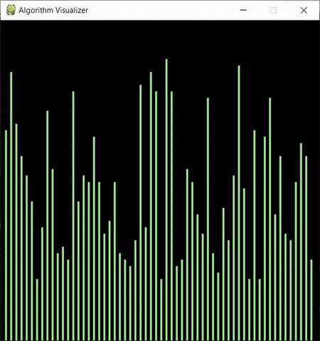
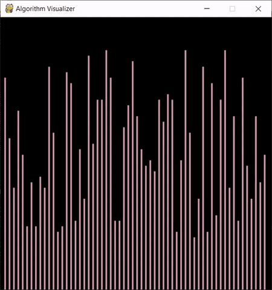
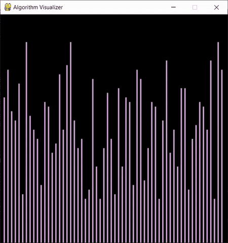

# Sorting Algorithm Visualizer

## Basic Idea
It is sometimes hard to conceptualize what exactly are algorithms doing, so having visualizations are often very helpful. So this program will be implementing several sorting in Python using the Pygame library to help us visualize these sorting algorithms. Currently the sorting algorithms that are implemented are Bubble Sort, Selection Sort, and Merge Sort.

## How to Use
After runnning the python script `python Algo_visual.py` you'll be loaded in to a blank canvas in pygame.
- Press the 'spacebar' to load the screen, or re-randomize the bars.
- Press 'b' to see Bubble Sort
- Press 's' to see Selection Sort
- Press 'm' to see Merge Sort
- Press 'q' to quit the program

## Sorting Algorithm (In Progress)

### 1. Bubble Sort

### 2. Selection Sort

### 3. Merge Sort

