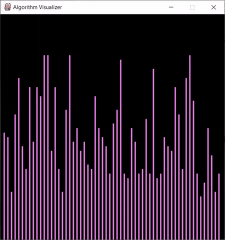
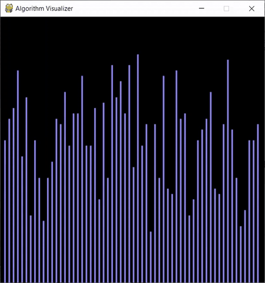

# Sorting Algorithm Visualizer

## Basic Idea
It is sometimes hard to conceptualize what exactly are algorithms doing, so having visualizations are often very helpful. So this program will be implementing several sorting in Python using the Pygame library to help us visualize these sorting algorithms. Currently the sorting algorithms that are implemented are Bubble Sort, Selection Sort, and Merge Sort. There are previews of the visualization of each sorting algorithm provided below (Beware that some of them are sped up).

## How to Use
To try out the script simply clone the repository and run the script by `python Algo_visual.py`.
After runnning the python script you'll be loaded in to a blank canvas in pygame. Use the following commands to see the sorts.
- Press the 'spacebar' to load the screen, or re-randomize the bars.
- Press 'b' to see Bubble Sort
- Press 's' to see Selection Sort
- Press 'm' to see Merge Sort
- Press 'c' to see Cocktail Sort
- Press 'g' to see Gnome Sort
- Press 'q' to quit the program

## Sorting Algorithm (In Progress)

### 1. Bubble Sort

### 2. Selection Sort

### 3. Merge Sort

### 4. Cocktail Sort

### 5. Gnome Sort

